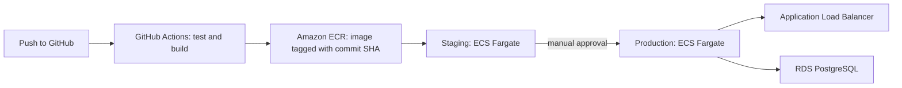

# Two Tone DevOps/Cloud Challenge: containerised Flask app


A small Flask API that I containerised with Docker, run together with PostgreSQL using Docker Compose, and wrapped in a GitHub Actions pipeline that tests and builds it on every push. A short AWS deployment plan is at the end.

The application code (`app.py`) is unchanged from the starter. All the work is in how it is packaged, run, tested and (on paper) deployed.

| Endpoint | Returns |
|---|---|
| `GET /` | `{"message": "Hello from Two Tone"}` |
| `GET /health` | App status, and whether it can reach PostgreSQL (HTTP 200 if yes or not configured, 503 if the database is unreachable) |

## What is in this repo

```
.
├── app.py                    # the Flask app (unchanged)
├── tests/                    # pytest tests (unchanged apart from the deliberate CI demo, see below)
├── requirements.txt          # runtime dependencies only (goes into the image)
├── requirements-dev.txt      # runtime + pytest (used by CI and for local testing)
├── Dockerfile                # multi-stage image build
├── .dockerignore             # keeps .git, .env, caches etc. out of the image
├── docker-compose.yml        # app + PostgreSQL, healthchecks, volume
├── .env.example              # template for the settings/secrets (the real .env is not committed)
└── .github/workflows/ci.yml  # the CI pipeline
```

## Run it locally (one command)

You need Docker (with Compose) installed and running.

```bash
git clone https://github.com/sosskusa/ship-it-devops.git
cd ship-it-devops

cp .env.example .env          # Windows PowerShell: copy .env.example .env
# Open .env and replace "change-me" with your own password.
# Use letters and digits only, because it is placed inside a connection URL.

docker compose up --build
```

Then, in a second terminal:

```bash
curl http://localhost:8000/
curl http://localhost:8000/health
```

On Windows PowerShell use `curl.exe` (plain `curl` is an alias for a different command).

Expected result for `/health`: `{"database":"connected","status":"ok"}`. Check `docker compose ps` to see both services as `healthy`.

Useful commands:

| Command | What it does |
|---|---|
| `docker compose up -d` | start in the background |
| `docker compose logs -f app` | follow the app logs |
| `docker compose down` | stop and remove containers, **keep** the database data |
| `docker compose down -v` | stop and remove containers **and delete** the database volume |

> If you change `POSTGRES_PASSWORD` after the first run, the app will fail to log in. PostgreSQL only reads that variable when it first initialises an empty volume. Run `docker compose down -v` and start again.

## Run the tests (without Docker)

```bash
python -m venv .venv
source .venv/bin/activate     # Windows PowerShell: .venv\Scripts\Activate.ps1
pip install -r requirements-dev.txt
pytest
```

## Design decisions

### Dockerfile

- **Multi-stage build.** Stage 1 installs the dependencies into a virtual environment. Stage 2 starts from a clean `python:3.12-slim` and copies in only that virtual environment and `app.py`. Build leftovers and caches stay behind, so the final image is smaller.
- **`slim`, not `alpine`.** `psycopg[binary]` ships precompiled packages for glibc-based Linux. Alpine uses musl, which risks build problems for no real gain here.
- **Layer caching.** `requirements.txt` is copied and installed before the code, so a change to `app.py` does not re-run the slow dependency install.
- **Runtime-only dependencies.** `pytest` lives in `requirements-dev.txt` and is not installed in the image.
- **Non-root user.** The container runs as `appuser`, so a compromised process has fewer privileges.
- **gunicorn** as the production server (as the starter README recommends), started in exec form so it receives stop signals directly.
- **`.dockerignore`** excludes `.git`, `.env`, `.venv`, caches and tests, so no secrets or junk can end up in the image.

### Docker Compose

- **Two services:** `app` (built from the Dockerfile) and `db` (`postgres:16-alpine`).
- **Secrets are not in the repo.** The password comes from a local `.env` file (git-ignored). `.env.example` documents the settings. The compose file uses `${POSTGRES_PASSWORD:?...}`, so it refuses to start if the password is missing instead of silently using a blank or default one.
- **The app finds the database by service name** (`@db:5432`) on Compose's private network, not `localhost`.
- **The database port is not published.** Only the app can reach PostgreSQL. It is not exposed to the host machine.
- **Named volume** `pgdata` keeps the data when containers are recreated.
- **Healthchecks.** `db` uses `pg_isready`. `app` calls its own `/health` endpoint using Python's standard library, because the slim image has no `curl`.
- **Start order.** `depends_on` with `condition: service_healthy` makes the app wait until PostgreSQL is actually accepting connections, not just until its container has started.

## CI pipeline

Defined in `.github/workflows/ci.yml`. It runs on every push and pull request, on a fresh Ubuntu runner, with steps that stop at the first failure:

1. Check out the code.
2. Set up Python 3.12 (with pip caching).
3. Install `requirements-dev.txt`.
4. **Run the tests** with `pytest`.
5. **Build the Docker image**, tagged with the commit SHA.
6. On failure only, print the container logs.

The workflow has read-only permissions, and no secrets are stored in the repository or in the workflow file.

### Evidence that the pipeline catches failures

I deliberately broke a test to confirm that CI fails when it should, then reverted it.

- Failing run (broken test, stopped at the "Run tests" step): `https://github.com/sosskusa/ship-it-devops/actions/runs/37541333661`
- Passing run (after the revert): `https://github.com/sosskusa/ship-it-devops/actions/runs/37542620917`

The red commit and its revert are both kept in the git history on purpose.

## Assumptions

- The app should be run as given: `app.py` is unchanged and listens on port 8000.
- Python 3.12 and PostgreSQL 16 are acceptable versions.
- No cloud account is available, so CI builds the image but does not push it to a registry or deploy it.
- The database does not need to be reachable from outside the Compose network.
- Database passwords use letters and digits only, because they are embedded in the `DATABASE_URL`.
- Tests run on the CI runner rather than inside the image, so the image stays free of test tooling.

## Deployment plan (AWS)

The goal is to run the same container image I tested, with a managed database, no secrets in code, safe releases and quick rollback. I would run it in the AWS Africa (Cape Town) region, `af-south-1`, to keep latency low for South African users, after confirming that the services below are available there.



**Build and artefacts**
- CI builds the image once and pushes it to Amazon ECR, tagged with the commit SHA. The exact same image is promoted from staging to production. It is never rebuilt, so what was tested is what ships.
- CI authenticates to AWS with GitHub OIDC, which uses short-lived credentials, instead of storing long-lived access keys.

**Compute and network**
- The app runs on **ECS with Fargate**, so there are no servers to patch, behind an **Application Load Balancer**.
- Tasks run in private subnets across at least two availability zones. Only the load balancer is public.

**Database**
- **Amazon RDS for PostgreSQL** instead of a container. Production is Multi-AZ with automated backups. Its security group only allows connections from the app.

**Secrets and configuration**
- The database credentials live in **AWS Secrets Manager** and are injected into the task as environment variables at start-up. Nothing sensitive is in the image, the repo or the pipeline logs.

**Environments**
- Staging and production are separate (ideally separate AWS accounts) and created from the same infrastructure-as-code, for example Terraform, so they match.
- A merge to `main` deploys to staging automatically. Production requires a manual approval step (a GitHub Environment).

**Releases and rollback**
- ECS rolling deployments with the **deployment circuit breaker and automatic rollback** enabled: if new tasks keep failing their health checks, the service reverts to the previous version by itself.
- Manual rollback means redeploying the previous commit-tagged image.
- A database snapshot is taken before each release, and schema changes are made backwards-compatible (add first, remove in a later release), so the old version still works if a rollback is needed.

**Monitoring and alerting**
- Container logs go to **CloudWatch Logs**.
- **CloudWatch alarms** on: load balancer 5xx errors and latency, unhealthy target count, ECS CPU and memory, and RDS CPU, connections and free storage.
- Alarms notify through SNS to email or Slack, and an external uptime check watches the public URL.

**One refinement I would make:** the load balancer should not use `/health` as its health check, because that endpoint also checks the database, and a short database blip would then remove every app task from rotation. I would split it into a liveness check (`/`, "is the process alive?") for the load balancer and keep `/health` as a readiness and diagnostics check.

## What I would do with more time

- Scan the image for vulnerabilities in CI (for example Trivy) and fail on high-severity findings.
- Push the image to a registry from CI and add the automated staging deploy.
- Pin the base images by digest and enable Dependabot for dependency and Actions updates.
- Cache Docker layers in CI to speed up builds.
- Add database migrations and a proper readiness/liveness split in the app.
- Add structured (JSON) logging and basic metrics.

## Notes

I used an AI assistant (Claude Sonnet 5.5) to help me learn the tools and review my work as I went. I built and ran everything locally myself, and I can explain each part of the setup.
